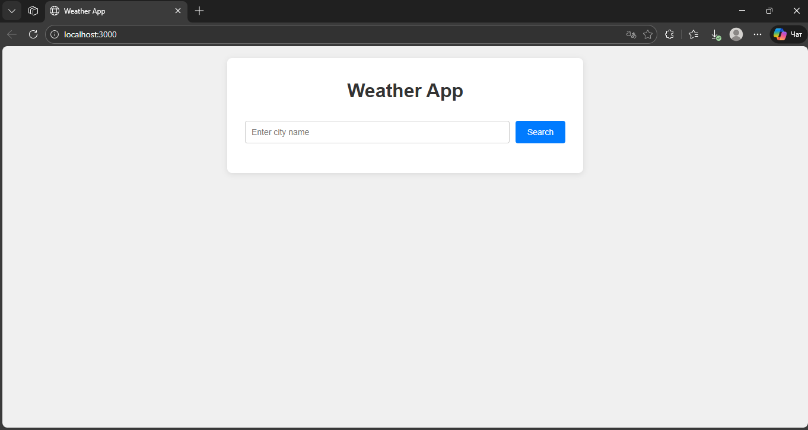
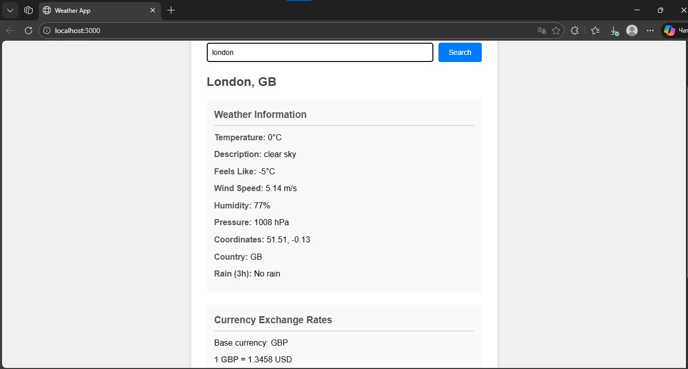
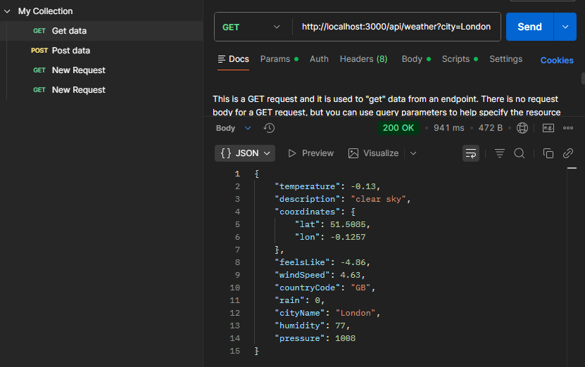
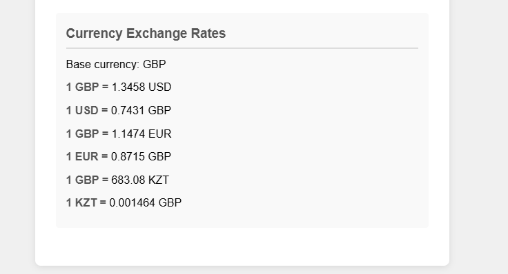
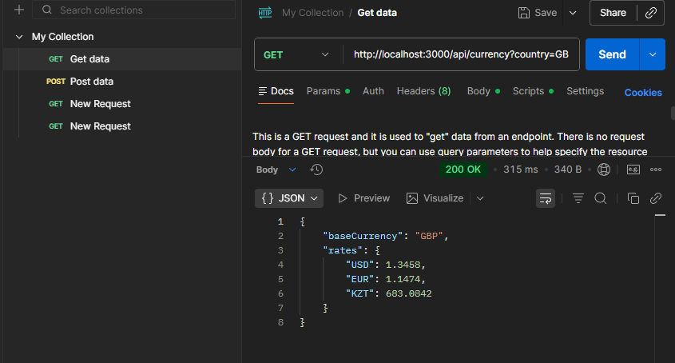
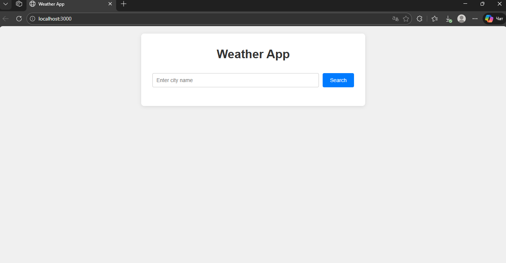
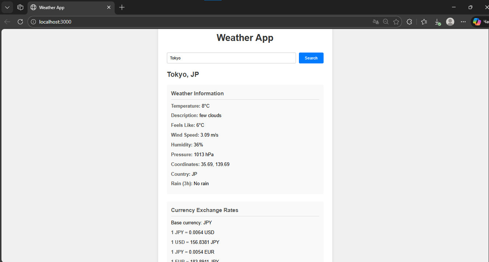
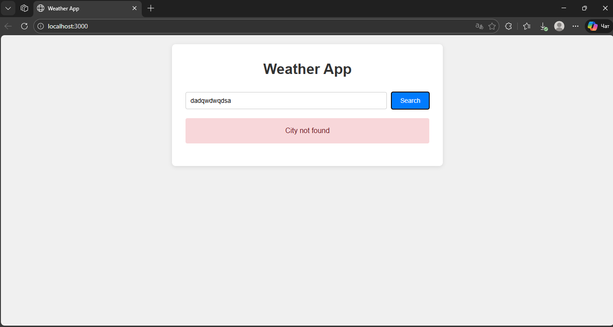
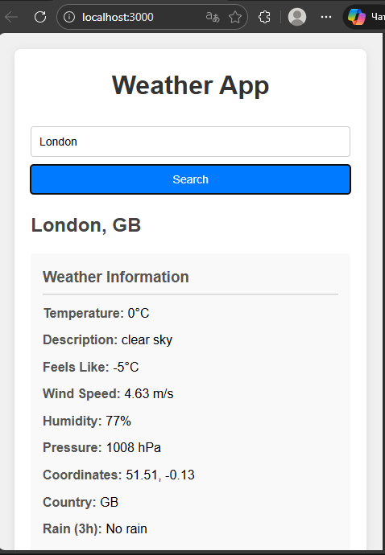

# Weather Application - Documentation

## Project Overview

This is a weather application that integrates two APIs: OpenWeather API for weather data and ExchangeRate API for currency conversion. The application retrieves data on the server side and displays it through a simple web interface.

---

## Setup Instructions

### Prerequisites

- Node.js installed on your system
- Text editor (VS Code recommended)
- Internet connection

### Installation Steps

1. Create a new folder for the project
2. Open terminal in the project folder
3. Initialize the project:
```bash
npm init -y
```

4. Install required dependencies:
```bash
npm install express axios dotenv cors
```

5. Create the following file structure:
```
weather-app/
├── .env
├── package.json
├── server.js
├── public/
│   ├── index.html
│   ├── style.css
│   └── script.js
```

### API Keys Setup

1. Register at OpenWeather API: https://openweathermap.org/api
2. Get your API key from the dashboard
3. Register at ExchangeRate API: https://exchangerate-api.com/
4. Get your API key after registration
5. Create `.env` file in root directory and add:
```
OPENWEATHER_API_KEY=openweather_key
EXCHANGE_RATE_API_KEY=exchangerate_key
PORT=3000
```

### Running the Application

1. Start the server:
```bash
node server.js
```

2. Open browser and navigate to:
```
http://localhost:3000
```



---

## API Usage Details

### OpenWeather API

**Endpoint:** `https://api.openweathermap.org/data/2.5/weather`

**Server Route:** `GET /api/weather?city=<city_name>`

**Parameters:**
- city: Name of the city (required)

**Response Data:**
- temperature: Current temperature in Celsius
- description: Weather description
- coordinates: Latitude and longitude
- feelsLike: Perceived temperature
- windSpeed: Wind speed in m/s
- countryCode: ISO country code
- rain: Rain volume for last 3 hours
- humidity: Humidity percentage
- pressure: Atmospheric pressure

**Example Request:**
```
GET http://localhost:3000/api/weather?city=London
```

**Example Response:**
```json
{
  "temperature": 15.2,
  "description": "clear sky",
  "coordinates": {
    "lat": 51.51,
    "lon": -0.13
  },
  "feelsLike": 14.5,
  "windSpeed": 3.5,
  "countryCode": "GB",
  "rain": 0,
  "cityName": "London",
  "humidity": 72,
  "pressure": 1013
}
```




---

### ExchangeRate API

**Endpoint:** `https://v6.exchangerate-api.com/v6/{api_key}/latest/{base_currency}`

**Server Route:** `GET /api/currency?country=<country_code>`

**Parameters:**
- country: ISO country code (required)

**Response Data:**
- baseCurrency: Currency code of the country
- rates: Exchange rates for USD, EUR, and KZT

**Example Request:**
```
GET http://localhost:3000/api/currency?country=GB
```

**Example Response:**
```json
{
  "baseCurrency": "GBP",
  "rates": {
    "USD": 1.2654,
    "EUR": 1.1689,
    "KZT": 619.45
  }
}
```



---

## Key Design Decisions

### Architecture

**Server-Side Processing:**
All API calls are made from the server rather than the client. This approach provides:
- API key security - keys are stored in environment variables
- Better error handling on the server
- Reduced client-side complexity

**Technology Stack:**
- Express.js: Lightweight web framework for Node.js
- Axios: Promise-based HTTP client for API requests
- CORS: Enables cross-origin requests
- dotenv: Manages environment variables

### API Integration

**Weather API Selection:**
OpenWeather API was chosen because it provides comprehensive weather data including temperature, wind speed, humidity, and rain volume in a single request.

**Currency API Selection:**
ExchangeRate API provides reliable exchange rates with a simple interface and sufficient free tier quota.

**Country-to-Currency Mapping:**
A mapping object was implemented to convert country codes to currency codes since the weather API returns country codes but the currency API requires currency codes.

### User Interface

**Minimalist Design:**
The interface uses a simple, clean design with:
- Single search input and button
- Clear separation between weather and currency sections
- Responsive layout for mobile and desktop

**Two-Way Currency Display:**
Currency rates are shown in both directions to provide complete information:
- Base currency to USD, EUR, KZT
- USD, EUR, KZT to base currency

This allows users to understand conversion rates in both contexts.

### Error Handling

**Client-Side:**
- Input validation before sending requests
- Loading state during API calls
- Error messages displayed to user

**Server-Side:**
- Try-catch blocks for all API calls
- Specific error messages for different failure types
- 404 errors for city not found
- 500 errors for server issues

### File Organization

Files are organized by function:
- `server.js`: All server logic and API routes
- `index.html`: Page structure
- `style.css`: All styling rules
- `script.js`: Client-side functionality

---

## Application Screenshots









---

## Dependencies
```json
{
  "express": "^4.18.2",
  "axios": "^1.6.0",
  "dotenv": "^16.3.1",
  "cors": "^2.8.5"
}
```